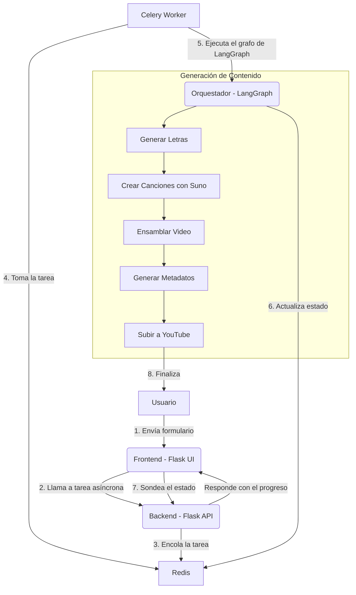

# Proyecto de Creación de Videos Musicales con IA

Este proyecto es una aplicación web full-stack diseñada para generar videos musicales completos a partir de un simple *prompt* de usuario. La aplicación orquesta múltiples servicios de IA para generar letras, componer música, ensamblar un video y subirlo a YouTube, todo de forma automatizada.

## Arquitectura y Flujo de Trabajo

El sistema está diseñado para ser robusto y escalable, separando la interfaz de usuario de las tareas pesadas de generación de contenido.



### Componentes Principales:

1.  **Frontend (Flask Web UI)**: Una sencilla interfaz de usuario construida con Flask y plantillas HTML. Permite al usuario introducir un tema o idea, seleccionar un estilo musical y especificar el número de canciones a crear.
2.  **Backend (Flask API)**: El servidor Flask que recibe las peticiones del usuario. No ejecuta las tareas pesadas directamente.
3.  **Gestor de Tareas Asíncronas (Celery & Redis)**: Al recibir una solicitud, el backend crea una tarea en segundo plano utilizando Celery. Redis actúa como *message broker* (para poner la tarea en cola) y como *backend* (para almacenar el estado y el resultado). Esto evita que la aplicación web se bloquee y permite al usuario ver el progreso en tiempo real.
4.  **Orquestador de Flujo de Trabajo (LangGraph)**: El corazón del proceso de generación. Una vez que un *worker* de Celery toma una tarea, ejecuta un grafo de estados definido con LangGraph. Este grafo gestiona cada paso de la creación del video de manera secuencial y robusta.
5.  **Módulos de IA**:
    *   **Generador de Letras**: Un módulo que utiliza un modelo de lenguaje para crear letras de canciones. Las letras se guardan en archivos `.txt` en la carpeta `songs/`.
    *   **Compositor Musical (Suno AI)**: Interactúa con la API de Suno AI para generar la música a partir de las letras y el estilo definidos.
    *   **Ensamblador de Video**: Combina las canciones y las letras en un archivo de video.
    *   **Generador de Metadatos**: Crea títulos, descripciones y etiquetas optimizadas para YouTube.
    *   **Cargador a YouTube**: Utiliza la API de YouTube para subir el video final a una cuenta especificada.

## Stack Tecnológico

*   **Backend**: Python, Flask
*   **Tareas Asíncronas**: Celery
*   **Broker y Backend de Tareas**: Redis
*   **Orquestación**: LangGraph
*   **IA y APIs Externas**:
    *   Generación de lenguaje (Letras, Metadatos): (No especificado, probablemente un LLM como Gemini/GPT)
    *   Generación Musical: Suno AI
    *   Plataforma de Video: YouTube Data API v3
*   **Frontend**: HTML, JavaScript (para sondeo de estado)
*   **Librerías de Python Clave**: `flask`, `celery`, `redis`, `langgraph`, `google-api-python-client`, etc. (ver `requirements.txt`).

## Estructura de Archivos

```
.
├── .gitignore
├── GEMINI.md
├── README.md
├── app.py
├── clips/                  # Almacena los clips de video generados
├── output/                 # Almacena los videos finales ensamblados
├── songs/                  # Almacena los audios (.mp3) y las letras (.txt)
├── requirements.txt
├── src
│   ├── config.py
│   ├── lyric_generator.py
│   ├── main_orchestrator.py
│   ├── metadata_generator.py
│   ├── suno_handler.py
│   ├── video_assembler.py
│   └── youtube_uploader.py
├── tasks.py
└── templates
    ├── index.html
    └── status.html
```

## Cómo Empezar

### Prerrequisitos

*   Python 3.8+
*   Redis Server (corriendo en `localhost:6379`)
*   Credenciales para las APIs de IA (Suno, YouTube, y el LLM para letras).
*   Una cuenta de Suno AI con créditos.
*   Un proyecto en Google Cloud con la API de YouTube Data v3 habilitada y un archivo `client_secrets.json`.

### Instalación y Ejecución

1.  **Clonar el repositorio:**
    ```bash
    git clone <URL-DEL-REPOSITORIO>
    cd <NOMBRE-DEL-REPOSITORIO>
    ```

2.  **Crear y activar un entorno virtual:**
    ```bash
    python -m venv .venv
    source .venv/bin/activate
    ```

3.  **Instalar las dependencias:**
    ```bash
    pip install -r requirements.txt
    ```

4.  **Configurar las variables de entorno:**
    Crea un archivo `.env` en la raíz del proyecto y añade las claves de API necesarias.
    ```
    SUNO_COOKIE="tu_cookie_de_suno"
    SECRET_KEY="una_clave_secreta_muy_larga_y_aleatoria"
    # Otras claves que puedan ser necesarias
    ```

5.  **Asegurarse de que Redis esté corriendo:**
    Puedes iniciar Redis con Docker o instalarlo localmente.
    ```bash
    redis-server
    ```

6.  **Iniciar un worker de Celery:**
    En una terminal, con el entorno virtual activado, ejecuta:
    ```bash
    celery -A tasks.celery_app worker --loglevel=info
    ```

7.  **Iniciar la aplicación Flask:**
    En otra terminal, con el entorno virtual activado, ejecuta:
    ```bash
    flask run --host=0.0.0.0 --port=8080
    ```

8.  **Acceder a la aplicación:**
    Abre tu navegador y ve a `http://localhost:8080`.
