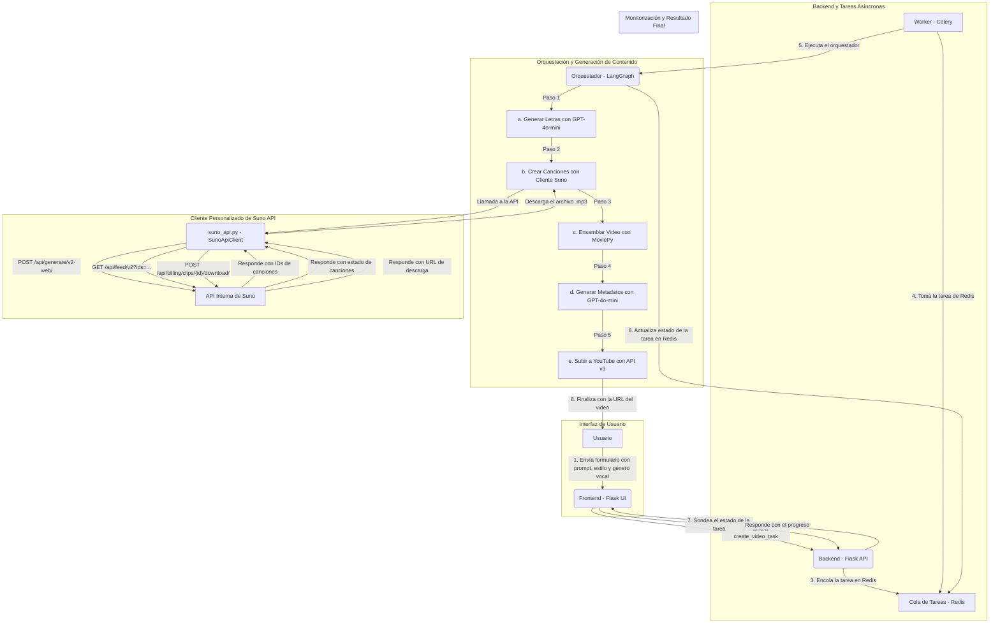

# Proyecto de Creación de Videos Musicales con IA

Este proyecto es una aplicación web full-stack diseñada para generar videos musicales completos a partir de un simple *prompt* de usuario. La aplicación orquesta múltiples servicios de IA para generar letras, componer música con control avanzado, ensamblar un video y subirlo a YouTube, todo de forma automatizada.

## Arquitectura y Flujo de Trabajo

El sistema está diseñado para ser robusto y escalable, separando la interfaz de usuario de las tareas pesadas de generación de contenido. La arquitectura se basa en una aplicación Flask que gestiona las solicitudes del usuario, una cola de tareas con Celery y Redis para procesar las solicitudes en segundo plano, y un orquestador de flujo de trabajo con LangGraph que coordina los diferentes servicios de IA.

### Diagrama de Arquitectura

El siguiente diagrama de Mermaid ilustra el flujo de trabajo completo del sistema, desde que el usuario envía el formulario hasta que el video es subido a YouTube.



### Componentes Principales

1.  **Frontend (Flask Web UI)**: Una interfaz de usuario simple creada con Flask y HTML/JavaScript que permite al usuario introducir un tema para la canción, un estilo musical, y especificar cuántas canciones con **voz femenina** y **voz masculina** desea crear.

2.  **Backend (Flask API)**: El servidor Flask (`app.py`) que recibe las peticiones del usuario, las valida y las delega a un sistema de tareas en segundo plano a través de Celery. También proporciona endpoints para monitorizar el estado de las tareas.

3.  **Gestor de Tareas Asíncronas (Celery & Redis)**: Al recibir una solicitud, el backend crea una tarea con Celery (`tasks.py`). Redis actúa como intermediario (broker) para la cola de tareas y como backend para almacenar los resultados y el estado de las mismas. Esto permite que la aplicación no se bloquee y que el usuario pueda ver el progreso en tiempo real.

4.  **Orquestador de Flujo de Trabajo (LangGraph)**: El corazón del sistema, implementado en `src/main_orchestrator.py`. Utiliza un grafo de estados de LangGraph para gestionar cada paso de la creación del video de forma secuencial y robusta. Cada nodo del grafo representa una etapa del proceso (generación de letras, creación de canciones, etc.) y se encarga de llamar al módulo correspondiente.

5.  **Módulos de IA y Clientes de API**:
    *   **Generador de Letras (`src/lyric_generator.py`)**: Utiliza el modelo `gpt-4o-mini` de OpenAI para crear letras de canciones basadas en el prompt y estilo del usuario.
    *   **Compositor Musical (`src/suno_handler.py` y `src/suno_api.py`)**: Interactúa directamente con la API interna de Suno a través de un **cliente personalizado (`SunoApiClient`)**. Este es el componente clave que hemos desarrollado y que permite las funcionalidades avanzadas de generación musical.
    *   **Ensamblador de Video (`src/video_assembler.py`)**: Utiliza la librería `moviepy` para combinar las canciones generadas y sus letras (como subtítulos) en un archivo de video final.
    *   **Generador de Metadatos (`src/metadata_generator.py`)**: Crea títulos, descripciones y etiquetas optimizadas para YouTube utilizando `gpt-4o-mini`.
    *   **Cargador a YouTube (`src/youtube_uploader.py`)**: Sube el video final a una cuenta de YouTube especificada utilizando la API de YouTube Data v3.

### Cliente Personalizado de Suno (`SunoApiClient`)

El componente más innovador de este proyecto es el cliente de API personalizado para Suno, `SunoApiClient`, implementado en `src/suno_api.py`. Este cliente nos permite interactuar con la API interna de Suno, la misma que utiliza la aplicación web de Suno, para tener un control total sobre la generación de canciones.

**Funcionamiento del Cliente:**

1.  **Autenticación**: El cliente se autentica obteniendo un token JWT de Clerk, el servicio de autenticación de Suno. Para ello, utiliza la cookie de sesión del usuario (`SUNO_COOKIE`) que se configura en el archivo `.env`.
2.  **Generación de Canciones**: El cliente envía una solicitud POST al endpoint `/api/generate/v2-web/` de la API de Suno. En esta solicitud se especifican todos los parámetros de la canción, como el prompt (letra), el título, el estilo (tags), el modelo a utilizar (`chirp-crow` para v5), y el género vocal (masculino o femenino).
3.  **Sondeo de Estado (Polling)**: La API de Suno no genera las canciones de forma síncrona. En su lugar, devuelve una lista de IDs de las canciones que se están generando. El cliente sondea el endpoint `/api/feed/v2` cada 10 segundos, pasando los IDs de las canciones, hasta que el estado de todas las canciones sea `complete`.
4.  **Descarga de Canciones**: Una vez que las canciones están completas, el cliente obtiene la URL de descarga de cada una enviando una solicitud POST al endpoint `/api/billing/clips/{id}/download/`. Finalmente, descarga el archivo de audio en formato MP3 y lo guarda en la carpeta `songs`.

**Funcionalidades Avanzadas Gracias al Cliente:**

*   **Generación con Modelo v5**: Todas las canciones se generan utilizando el modelo `chirp-crow` (v5) de Suno para asegurar la máxima calidad de audio.
*   **Control de Género Vocal**: Desde la interfaz principal, se puede definir el número exacto de canciones a generar con voz femenina y masculina.
*   **Generación Inteligente de Instrumentales**: Si se inicia una generación de canción pero se omite la letra, el sistema lo detecta automáticamente y le pide a Suno que genere una pista instrumental.
*   **Organización por Proyectos**: Todas las canciones generadas a través de la API se guardan automáticamente en un ID de proyecto predefinido en la cuenta de Suno, facilitando la organización.

#### Flujo de Autenticación y Payload de Generación

Para asegurar una interacción exitosa con la API de Suno, es crucial seguir el flujo de autenticación correcto y estructurar el payload de la solicitud de generación de la manera que la API espera. Estos detalles se han descubierto analizando las solicitudes de la aplicación web de Suno y pueden cambiar en el futuro.

**Flujo de Autenticación en 2 Pasos:**

1.  **Obtener Token JWT de Clerk**:
    *   Se realiza una solicitud `GET` al endpoint de Clerk: `https://clerk.suno.com/v1/client?__clerk_api_version=...`
    *   Esta solicitud utiliza la `SUNO_COOKIE` para identificar al usuario.
    *   La respuesta contiene un token JWT (`last_active_token.jwt`) que se usará como `Bearer Token` en las siguientes solicitudes.

2.  **Obtener `session_id` de la API de Suno**:
    *   Con el token JWT en la cabecera `Authorization`, se realiza una solicitud `GET` al endpoint: `https://studio-api.prod.suno.com/api/user/get_user_session_id/`.
    *   La respuesta es un objeto JSON que contiene el `session_id`.

**Estructura del Payload para Generación (`/api/generate/v2-web/`)**

La solicitud `POST` para generar una canción debe contener un payload JSON con una estructura específica. A continuación se detallan los campos clave:

```json
{
    "project_id": "ID_DEL_PROYECTO",
    "generation_type": "TEXT",
    "mv": "chirp-crow",
    "prompt": "Letra completa de la canción...",
    "tags": "Estilo musical, descripción...",
    "title": "Título de la canción",
    "make_instrumental": false,
    "transaction_uuid": "UUID_ALEATORIO_AQUÍ",
    "token": null,
    "metadata": {
        "create_mode": "custom",
        "stream": true,
        "priority": 10,
        "control_sliders": {
            "style_weight": 0.5,
            "weirdness_constraint": 0.5
        },
        "web_client_pathname": "/create",
        "is_max_mode": false,
        "is_mumble": false,
        "create_session_token": "OTRO_UUID_ALEATORIO_AQUÍ",
        "disable_volume_normalization": false,
        "vocal_gender": "female"
    }
}
```

**Puntos Clave a Recordar:**

*   **`transaction_uuid` y `create_session_token`**: Deben ser UUIDs v4 únicos generados para cada nueva solicitud.
*   **`token`**: Este campo debe estar presente, aunque su valor puede ser `null`.
*   **`vocal_gender`**: Este campo va anidado dentro del objeto `metadata`.

## Stack Tecnológico

*   **Backend**: Python, Flask
*   **Tareas Asíncronas**: Celery, Redis
*   **Orquestación**: LangGraph
*   **IA y APIs Externas**:
    *   Generación de Lenguaje: OpenAI (`gpt-4o-mini`)
    *   Generación Musical: Suno AI (vía API interna con cliente propio)
    *   Plataforma de Video: YouTube Data API v3
*   **Frontend**: HTML, JavaScript
*   **Librerías Clave**: `flask`, `celery`, `redis`, `langgraph`, `openai`, `moviepy`, `google-api-python-client`.

## Estructura de Archivos y Carpetas

```
.
├── app.py                  # Servidor Flask: define las rutas de la API y la interfaz de usuario.
├── tasks.py                # Define las tareas de Celery que se ejecutan en segundo plano.
├── requirements.txt        # Lista de dependencias de Python.
├── .env                    # Variables de entorno necesarias.
├── .gitignore              # Archivos y carpetas ignorados por Git.
├── README.md               # Esta documentación.
├── clips/                  # Carpeta para los videoclips de fondo.
├── output/                 # Carpeta donde se guarda el video final renderizado.
├── songs/                  # Carpeta donde se guardan las canciones generadas por Suno.
├── src/                    # Módulos principales de la aplicación.
│   ├── config.py           # Carga y gestiona las variables de entorno y la configuración.
│   ├── lyric_generator.py  # Módulo para generar letras con OpenAI.
│   ├── main_orchestrator.py# Orquestador principal con LangGraph que define el flujo de trabajo.
│   ├── metadata_generator.py# Módulo para generar metadatos de YouTube con OpenAI.
│   ├── suno_api.py         # Cliente de bajo nivel para la API interna de Suno.
│   ├── suno_handler.py     # Manejador que utiliza SunoApiClient para generar y descargar canciones.
│   ├── video_assembler.py  # Módulo para ensamblar el video final con MoviePy.
│   └── youtube_uploader.py # Módulo para subir el video a YouTube.
├── templates/              # Plantillas HTML para la interfaz de usuario de Flask.
│   ├── index.html          # Formulario principal para iniciar la creación del video.
│   ├── status.html         # Página para ver el progreso de la tarea de creación.
│   └── test.html           # Página de prueba para el cliente de Suno.
└── venv/                   # Entorno virtual de Python.
```

## Cómo Empezar

### Prerrequisitos

*   Python 3.8+
*   Redis Server corriendo localmente.
*   Un archivo `.env` con las credenciales para `OPENAI_API_KEY` y `SUNO_COOKIE`.
*   Un proyecto en Google Cloud con la API de YouTube Data v3 habilitada y un archivo `client_secrets.json`.

### Instalación y Ejecución

1.  **Clonar el repositorio y configurar el entorno:**
    ```bash
    git clone <URL_DEL_REPOSITORIO>
    cd yt-video-auto
    python -m venv venv
    source venv/bin/activate
    pip install -r requirements.txt
    cp .env-example .env
    # Ahora edita el archivo .env con tus credenciales.
    ```

2.  **Iniciar Servicios (en terminales separadas):**
    ```bash
    # Terminal 1: Servidor Redis
    redis-server

    # Terminal 2: Worker de Celery
    celery -A tasks.celery_app worker --loglevel=info

    # Terminal 3: Aplicación Flask
    flask run --host=0.0.0.0 --port=8080
    ```

3.  **Acceder y Usar:**
    *   Abre tu navegador en `http://localhost:8080`.
    *   Rellena el tema de la canción, el estilo, y el número de canciones que deseas para cada género vocal.
    *   Haz clic en "¡Crear Video!" y sigue el progreso en la página de estado.
    *   Para la autenticación de YouTube, la primera vez que se suba un video, se te pedirá que sigas un flujo de autenticación en la terminal donde se está ejecutando el worker de Celery.
