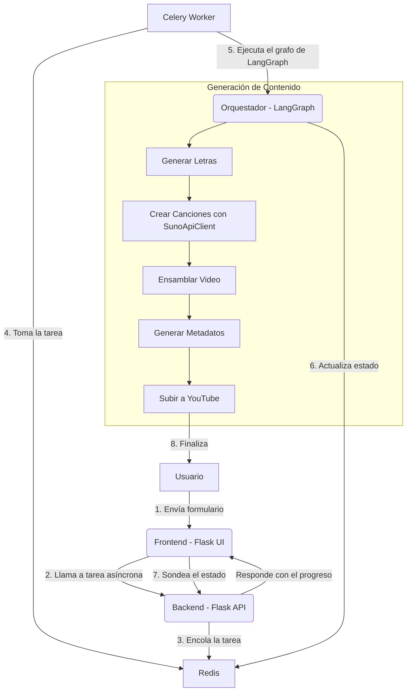

# Proyecto de Creación de Videos Musicales con IA

Este proyecto es una aplicación web full-stack diseñada para generar videos musicales completos a partir de un simple *prompt* de usuario. La aplicación orquesta múltiples servicios de IA para generar letras, componer música con control avanzado, ensamblar un video y subirlo a YouTube, todo de forma automatizada.

## Arquitectura y Flujo de Trabajo

El sistema está diseñado para ser robusto y escalable, separando la interfaz de usuario de las tareas pesadas de generación de contenido.



### Componentes Principales:

1.  **Frontend (Flask Web UI)**: Una interfaz de usuario que permite al usuario introducir un tema, un estilo musical y, más importante, especificar cuántas canciones con **voz femenina** y **voz masculina** desea crear.
2.  **Backend (Flask API)**: El servidor Flask que recibe las peticiones y las delega a un sistema de tareas en segundo plano.
3.  **Gestor de Tareas Asíncronas (Celery & Redis)**: Al recibir una solicitud, el backend crea una tarea con Celery. Redis gestiona la cola de tareas y almacena los resultados, permitiendo que la aplicación no se bloquee y que el usuario pueda ver el progreso.
4.  **Orquestador de Flujo de Trabajo (LangGraph)**: El corazón del sistema. Un grafo de estados que gestiona cada paso de la creación del video. Ahora incluye lógica para distribuir la generación de canciones entre voces masculinas y femeninas según lo solicitado.
5.  **Módulos de IA y Clientes de API**:
    *   **Generador de Letras**: Utiliza `gpt-4o-mini` para crear letras de canciones basadas en el prompt y estilo del usuario.
    *   **Compositor Musical (`SunoApiClient`)**: Interactúa directamente con la API interna de Suno a través de un **cliente personalizado (`suno_api.py`)**. Este es el componente clave que hemos desarrollado y que permite las funcionalidades avanzadas.
    *   **Ensamblador de Video**: Combina las canciones generadas y sus letras (como subtítulos) en un archivo de video final.
    *   **Generador de Metadatos**: Crea títulos, descripciones y etiquetas optimizadas para YouTube.
    *   **Cargador a YouTube**: Sube el video final a una cuenta de YouTube especificada.

### Funcionalidades Avanzadas de Generación

Gracias al nuevo `SunoApiClient`, el sistema ahora soporta:

*   **Generación con Modelo v5**: Todas las canciones se generan utilizando el modelo `chirp-crow` (v5) de Suno para asegurar la máxima calidad de audio.
*   **Control de Género Vocal**: Desde la interfaz principal, se puede definir el número exacto de canciones a generar con voz femenina y masculina.
*   **Generación Inteligente de Instrumentales**: Si se inicia una generación de canción pero se omite la letra, el sistema lo detecta automáticamente y le pide a Suno que genere una pista instrumental, permitiendo además especificar un título.
*   **Organización por Proyectos**: Todas las canciones generadas a través de la API se guardan automáticamente en un **ID de proyecto predefinido** en la cuenta de Suno, facilitando la organización.

## Stack Tecnológico

*   **Backend**: Python, Flask
*   **Tareas Asíncronas**: Celery, Redis
*   **Orquestación**: LangGraph
*   **IA y APIs Externas**:
    *   Generación de Lenguaje: OpenAI (`gpt-4o-mini`)
    *   Generación Musical: Suno AI (vía API interna con cliente propio)
    *   Plataforma de Video: YouTube Data API v3
*   **Frontend**: HTML, JavaScript
*   **Librerías Clave**: `flask`, `celery`, `redis`, `langgraph`, `openai`, `moviepy`, `google-api-python-client`.

## Estructura de Archivos

```
.
├── app.py                  # Servidor Flask y rutas API
├── tasks.py                # Definición de tareas de Celery
├── templates/
│   ├── index.html          # Formulario principal
│   └── ...
├── src/
│   ├── suno_api.py         # NUEVO: Cliente de bajo nivel para la API de Suno
│   ├── suno_handler.py     # Manejador que usa SunoApiClient
│   ├── main_orchestrator.py  # Lógica principal con LangGraph
│   └── ...                 # Otros módulos (generación, video, etc.)
└── ...
```

## Cómo Empezar

### Prerrequisitos

*   Python 3.8+
*   Redis Server corriendo localmente.
*   Un archivo `.env` con las credenciales para `OPENAI_API_KEY` y `SUNO_COOKIE`.
*   Un proyecto en Google Cloud con la API de YouTube Data v3 habilitada y un archivo `client_secrets.json`.

### Instalación y Ejecución

1.  **Entorno virtual e instalación:**
    ```bash
    python -m venv .venv
    source .venv/bin/activate
    pip install -r requirements.txt
    ```

2.  **Iniciar Servicios (en terminales separadas):**
    ```bash
    # Terminal 1: Servidor Redis
    redis-server

    # Terminal 2: Worker de Celery
    celery -A tasks.celery_app worker --loglevel=info

    # Terminal 3: Aplicación Flask
    flask run --host=0.0.0.0 --port=8080
    ```

3.  **Acceder y Usar:**
    *   Abre tu navegador en `http://localhost:8080`.
    *   Rellena el tema de la canción, el estilo, y el número de canciones que deseas para cada género vocal.
    *   Haz clic en "¡Crear Video!" y sigue el progreso en la página de estado.